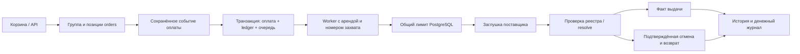

# Устройство и решения

## Основной поток

`orders` по-прежнему обозначает одну позицию. `order_groups` объединяет позиции без переписывания первого этапа. Выдача и возврат завершаются независимо по каждой позиции; агрегат получает частичный либо полный результат. Снимок цены в заказе не зависит от последующей цены витрины.

## Повторы и границы транзакций

Платёж сначала сохраняется в `payment_events`. Событие, пришедшее до создания заказа, остаётся для последующей обработки. Уникальные ID событий, фактов выдачи, возвратов и пользовательских операций ограничивают повтор. Изменённое тело запроса с тем же идентификатором отклоняется там, где операция связывает ID и payload.

Сетевой вызов поставщика не включён в длинную денежную транзакцию. Устойчивый `request_id` связывает повтор с тем же внешним действием. Worker получает lease и номер захвата; после истечения аренды прежний worker не может завершить локальную фиксацию. Recovery восстанавливает потерянные задания и истёкшие аренды, сохраняя бюджет попыток и задержку лимита.

Ошибка или timeout не доказывают отсутствие выдачи. Проверяются реестр ключей и факт выдачи с соответствием SKU, поставщика, запроса, заказа и партии. `resolve` возвращает подтверждённую выдачу либо фиксирует отмену под той же блокировкой, что и выдача. Отмена запрещает поздний выпуск ключа. Уникальность `deliveries.code` защищает от повторной продажи одного кода, а уникальность заказа — от второй выдачи позиции.

Это модель с авторитетным проверяемым реестром заглушки. Без доступа к достоверному состоянию внешней системы невозможно доказать реальную активацию ключа. Пока resolve недоступен, оплаченная позиция ждёт восстановления связи; произвольный возврат при неизвестном результате не выполняется.

## Деньги

В процессе `paid = delivered + refunded + pending`; после завершения `pending = 0`. Оплата переносит сумму из cash/wallet в customer_clearing; выдача — из clearing в sales; возврат — из clearing в wallet пользователя. Возврат уже выданного товара сначала сторнирует sales. Двойная запись защищена deferred-проверкой нулевой суммы при COMMIT.

Пополнение, бонус, платёжный код, покупка, возврат и вывод отражены в ledger. Баланс пользователя и проводка изменяются одной транзакцией. Вывод сначала резервирует деньги в withdrawal_clearing, а не списывает их повторно при подтверждении.

Отчёт продавца опирается на `seller_order_financials`: доход за вычетом возврата минус закупочная стоимость выданных ключей. Закупка фиксируется при выдаче; `NULL` остаётся неизвестной себестоимостью. Отозванный ключ остаётся расходом. Комиссия равна нулю, автоматическая выплата выручки продавцу не моделируется.

## Лимиты и история

Скользящий интервал 60 секунд и строковая блокировка поставщика дают общий бюджет для всех процессов; учитываются исходящие issue и resolve. Неоплаченные заказы не занимают канал выдачи. Очередь остаётся в PostgreSQL, worker не держит её только в памяти.

Добавляемые снимки и денежные операции связаны с бизнес-транзакцией. PostgreSQL работает с `track_commit_timestamp=on`; фактический COMMIT архивируется в `operation_commits`, пропущенное архивирование подбирает recovery. История новых операций доступна с микросекундами. Для данных до миграции 011 используется явно помеченная реконструкция, поскольку исторический точный COMMIT не был сохранён.

## Ключи, цены и права

`seller_offers` остаётся единым источником цены. Ключ связан с конкретным предложением/партией через FK. Checkout резервирует конкретный свободный ключ; изменение цены одного ключа отделяет только его от общей партии. Повторы PUT не плодят предложения. Резерв, выдача и отзыв закрывают изменение цены/закупки и перенос в другую партию.

Публичная регистрация не принимает admin или произвольный идентификатор магазина. Покупатель подключает собственный магазин к тому же аккаунту. Владение заказом, складом, сообщениями и отзывом проверяется сервером. Бан отзывает сессии, отключает предложения и блокирует оплату ранее собранной корзины. Публичные доказательства нарушений не содержат секретных кодов.

## Границы демо

Деньги, СБП, USDT, вывод и поставщики — заглушки по ТЗ. Суммы сохраняют целые единицы первого этапа: 500 означает 500 тестовых рублей, несмотря на историческое имя `price_minor`. Нет интеграции с банком, блокчейном, Steam или реальным эквайрингом. CI и локальные проверки подтверждают описанные сценарии, а не производственную сертификацию или неограниченную нагрузку.
